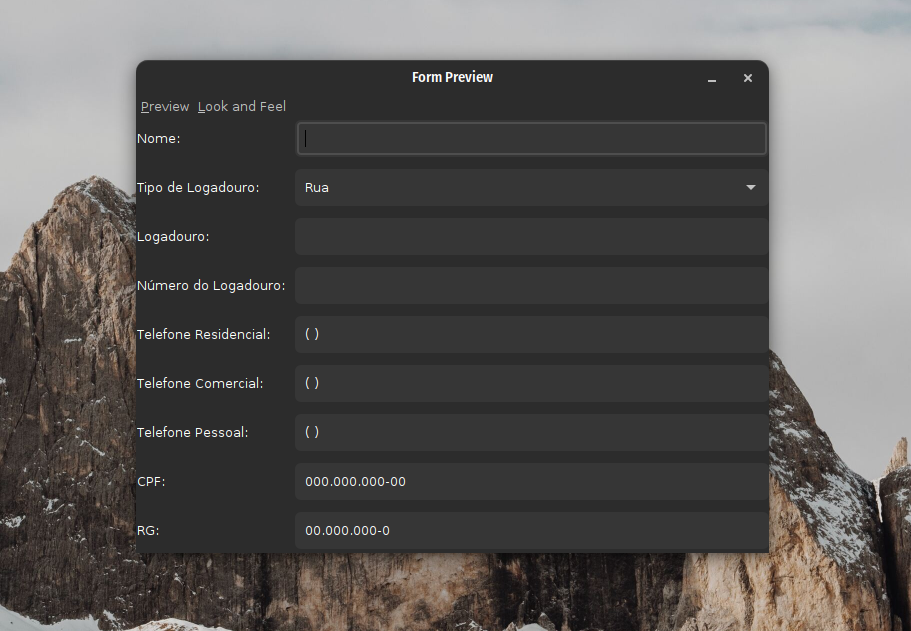

<h1 align="center">📚 Aplicação utilizando JFrame - Programação Orientada a Objetos II</h1>

> Atividade aplicada pelo professor Adriano Maia.

## 📢 Sobre a Questão

Devemos criar um programa utilizando a biblioteca JFrame responsável que será responsável por cadastrar um usuário 
em um determinado sistema.

### 📋 Critérios avaliados

1. Criar mascarás para o CPF, RG e Números telefonicos.;
2. Campos que foram definidos no slide devem ser obrigatórios;

## 🎯 Dependências para rodar a aplicação

- `Java 18`
- `JFrame`

---

  Developer with ❤️‍🔥 by Lucas Souza (@deverebor)

